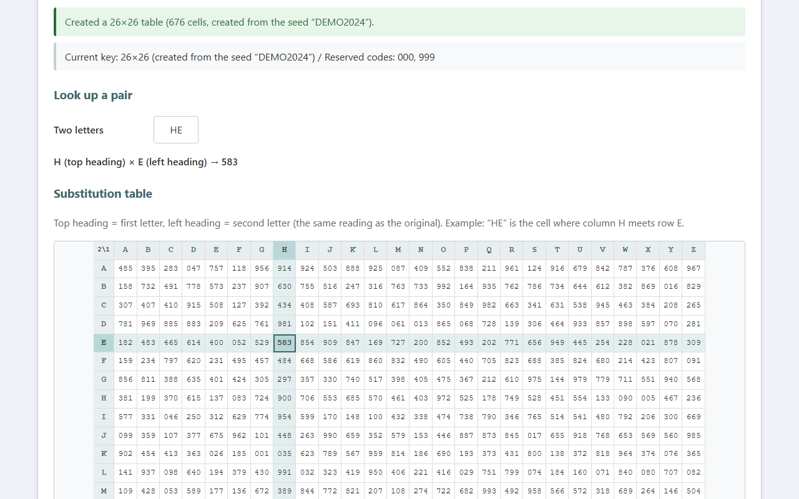
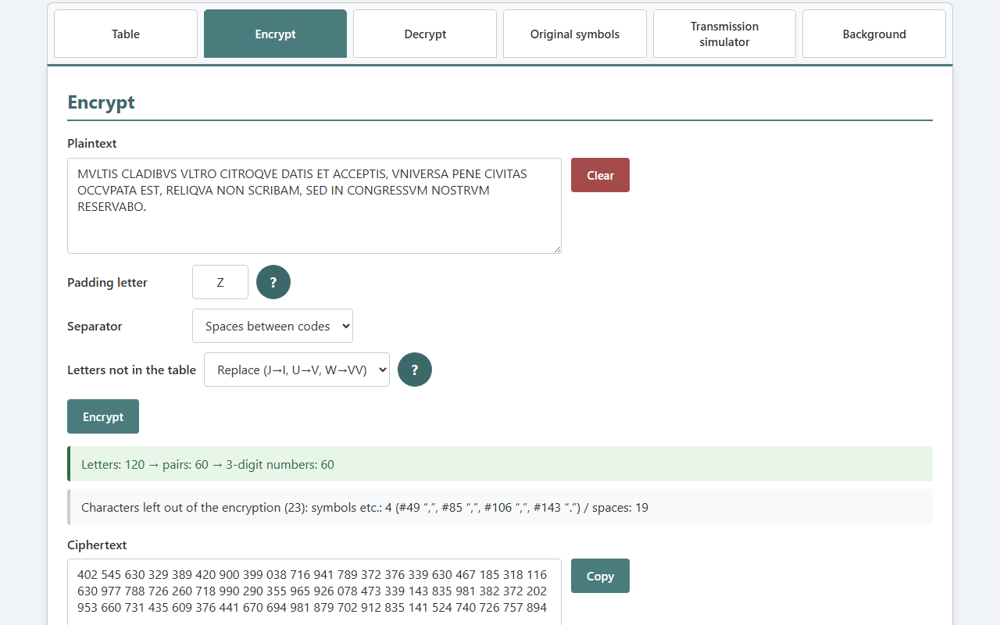
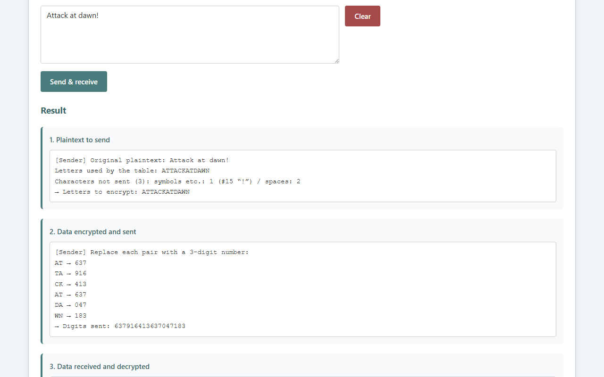
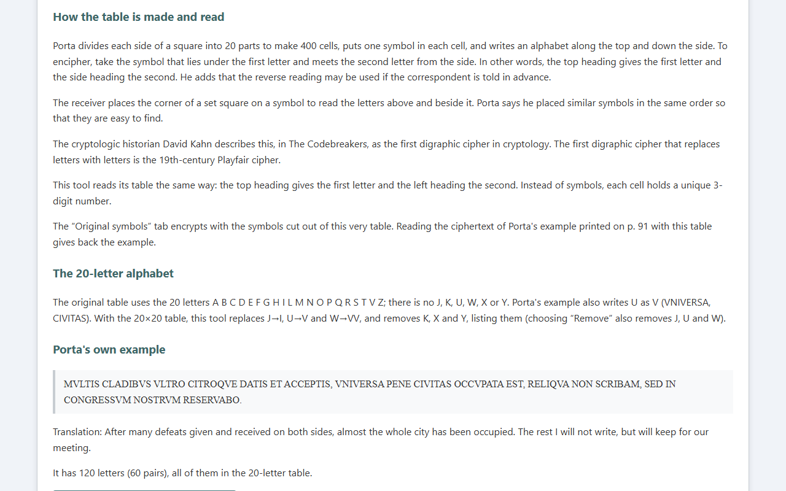
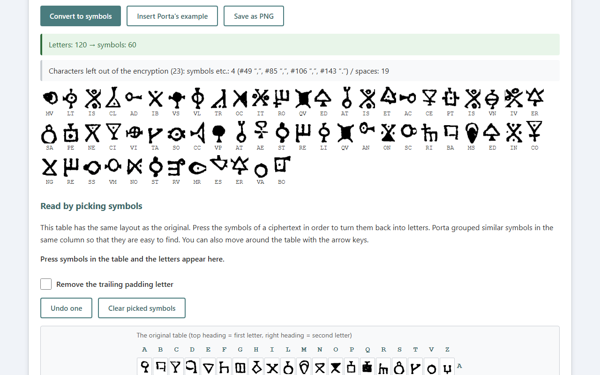
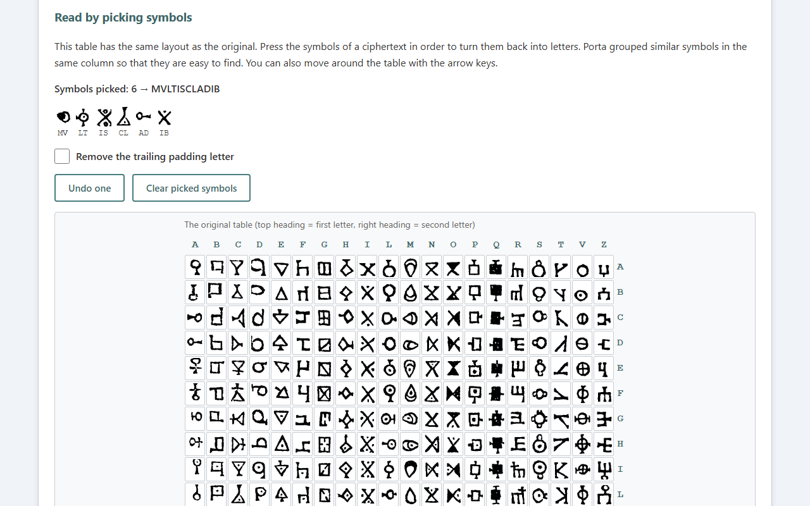
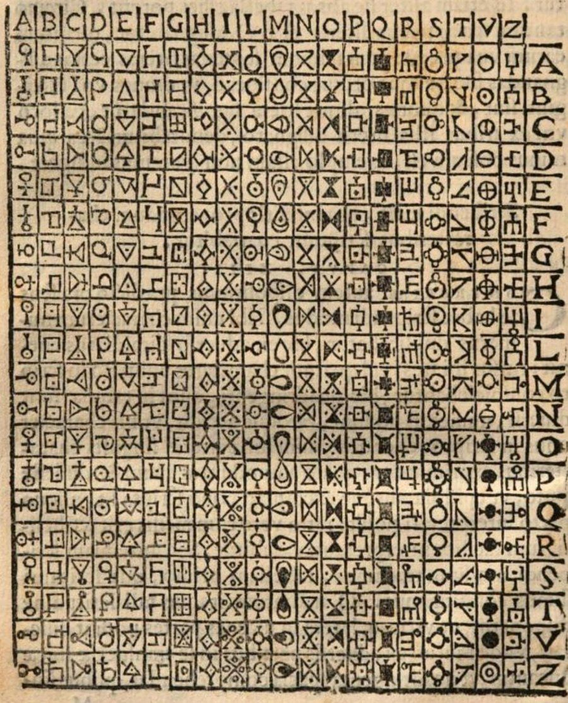
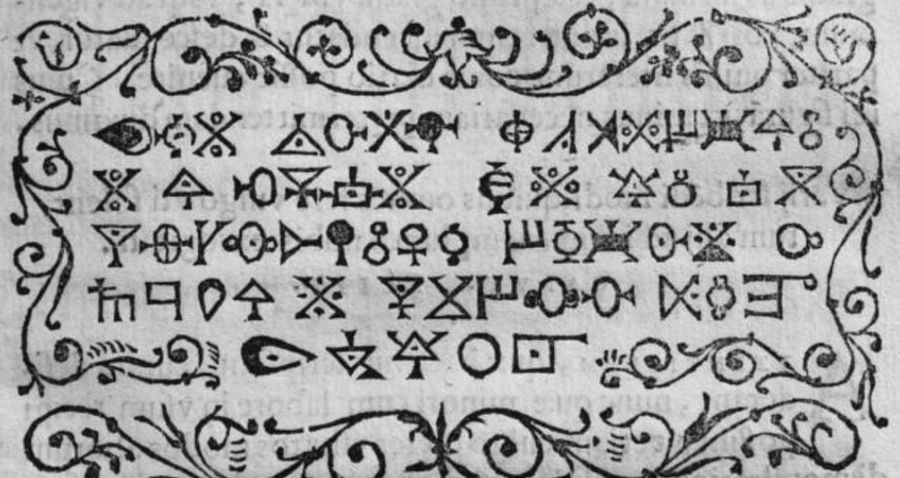

English · [日本語](README.md)

# Porta CipherLab - Porta's Digraphic Cipher Tool


[](https://ipusiron.github.io/porta-cipherlab/)

**Day080 - 100 Security Tools with Generative AI**

**Porta CipherLab** is an educational tool for the digraphic cipher that the Italian scholar Giovanni Battista della Porta (c. 1535–1615) presented in his cipher book of 1563.
It splits the plaintext into pairs of letters and replaces each pair with one cell of a table. Porta put symbols in the cells; this tool puts a unique 3-digit number in each cell.
You can also encrypt and decrypt with the original symbols cut out of the table in the 1563 first edition, and the interface switches between Japanese and English.

---

## 🌐 Demo

👉 **[https://ipusiron.github.io/porta-cipherlab/](https://ipusiron.github.io/porta-cipherlab/)**

Try it directly in your browser.

---

## 📸 Screenshots

>
>*In a 26×26 table (seed "DEMO2024"), looking up "HE" highlights the cell where column H meets row E (583)*
>
>
>*With the original 20×20 table, Porta's own example (120 letters) becomes 60 numbers*
>
>
>*Transmission simulator. Both AT pairs in "Attack at dawn!" become 637*
>
>
>*Background tab: how the table is made and read according to the original, the 20-letter alphabet, and Porta's own example*
>
>
>*Original symbols tab. Porta's example becomes 60 symbols cut out of the table in the 1563 first edition*
>
>
>*Press symbols in a table with the original layout (top = first letter, right = second letter) to turn them back into letters*

---

## ✨ Features

### 🔑 Substitution table (key)

- Table size: 20×20 (the original 20 letters) or 26×26 (all letters A–Z)
- Creation: the same seed rebuilds the same table; with an empty seed the table is built from cryptographic randomness (`crypto.getRandomValues`)
- Reserved codes: 3-digit numbers that are never placed in a cell (000 and 999 by default)
- Look up a pair: enter two letters to highlight their cell in the table
- Saving and loading keys: JSON files (the shape and values are validated on loading)

### 🔐 Encryption

- Splits the letters of the plaintext (including full-width and lowercase letters) into pairs and replaces each pair with a 3-digit number
- If the number of letters is odd, one padding letter is added at the end (X for 26×26 and Z for 20×20 by default; both are in their tables)
- Letters not in the 20×20 table can be replaced (J→I, U→V, W→VV) or removed (K, X and Y are always removed)
- Spaces, symbols and digits are left out of the encryption and listed by kind with their positions
- The output can be separated by spaces or joined in groups of 3 digits
- The pairs and their numbers are listed

### 🔓 Decryption

- Looks the 3-digit numbers up in the table to recover the pairs
- Reports format errors (items that are not 3-digit numbers, leftover digits, non-digits) with their positions
- Numbers not in the table are shown as "??", and reserved codes are reported separately
- You can choose whether to remove the trailing padding letter

### 🖋️ Original symbols

- Converts plaintext into a sequence of the 400 symbols cut out of the table on p. 90 of the 1563 first edition (with the letter pairs shown below and PNG export)
- Press symbols in a table with the original layout to turn them back into letters (the arrow keys work too)
- Practice reading the ciphertext of Porta's example printed on p. 91 with the table, with the answer

### 📡 Transmission simulator

- Runs the sender's encryption → transmission of the digits → the receiver's decryption in one go with the current table
- Shows the pairs and numbers at each step and the characters that were not sent or were replaced, and checks whether the received letters match

### 🌏 Japanese and English

- Switch between Japanese and English with the button at the top right (or with `?lang=ja` / `?lang=en` in the URL)
- The chosen language is saved in the browser (switching still works where storage is unavailable). Without a choice, the browser language decides
- Switching redraws the results on screen too (status messages, lists, simulator output, symbol labels)

### 📚 Background

- How the table is made and read, and the 20-letter alphabet, based on the original (1563 first edition, Book II, Chapter 13)
- Porta's own example, with a button that puts it in the Encrypt tab
- Porta's claim that "the same symbol rarely appears twice in a text", measured against English text
- Related tools and sources

---

## 📖 Usage

1. In the "Table" tab, choose the table size and press "Create table" (a seed lets you rebuild the same table)
2. In the "Encrypt" tab, enter the plaintext and press "Encrypt"
3. Give your correspondent the same table (the seed or the saved key file) and the ciphertext
4. The correspondent enters the ciphertext in the "Decrypt" tab and presses "Decrypt"

The "Transmission simulator" tab shows the whole flow at once.
To try the original symbols, use the "Original symbols" tab (the table is fixed to the original 20×20).

---

## 📜 Porta's digraphic cipher

### The original

>
>*The table on p. 90 of the 1563 first edition. The top heading gives the first letter and the right-hand heading the second (scan of the copy in the Lyon Public Library, Public Domain Mark 1.0)*

Porta presented this table in Book II, Chapter 13 of *De Furtivis Literarum Notis, vulgo de Ziferis libri IIII*, published in Naples in 1563.
It is a different system from the reciprocal polyalphabetic cipher that is also called the "Porta cipher".
The cryptologic historian David Kahn calls it the first digraphic cipher in cryptology in *The Codebreakers* (1967, p. 139).
The first digraphic cipher that replaces letters with letters is the 19th-century Playfair cipher (same book, p. 200).

- Making the table: divide each side of a square into 20 parts to make 400 cells, put one symbol in each cell, and write an alphabet along the top and down the side
- Reading the table: take the symbol that lies under the first letter and meets the second letter from the side. In other words, the top heading gives the first letter and the side heading the second. Porta adds that the reverse reading may be used if the correspondent is told in advance
- The receiver: places the corner of a set square on a symbol to read the letters above and beside it. Similar symbols are placed in the same order so that they are easy to find
- The 20-letter alphabet: A B C D E F G H I L M N O P Q R S T V Z (no J, K, U, W, X or Y). The example also writes U as V

This tool reads its table the same way: the top heading gives the first letter and the left heading the second.

### Porta's own example

```text
MVLTIS CLADIBVS VLTRO CITROQVE DATIS ET ACCEPTIS, VNIVERSA PENE CIVITAS OCCVPATA EST,
RELIQVA NON SCRIBAM, SED IN CONGRESSVM NOSTRVM RESERVABO.
```

A translation: "After many defeats given and received on both sides, almost the whole city has been occupied. The rest I will not write, but will keep for our meeting."
It has 120 letters (60 pairs), all of them in the 20-letter table.

Page 91 prints the ciphertext of this example in the symbols of the table.
Compared one by one with the symbols looked up with "first letter = top heading, second letter = side heading", all 60 appear in the same order (15, 12, 15, 13 and 5 per line).
With the reversed reading (first letter on the side heading), they differ from the very first symbol.
You can check this comparison in the "Original symbols" tab.

>
>*The ciphertext of the example on p. 91 of the 1563 first edition (60 symbols in 5 lines; scan of the copy in the Lyon Public Library, Public Domain Mark 1.0)*

### Is the same symbol really "rare"?

Porta says that, because two letters become one symbol, the same symbol rarely appears twice in a text.
Yet even in the 120 letters of his example, the pair IS appears three times and QV, ED, AT, ER, ST and RE twice each.
Counting 200 random passages from an English novel (Dickens, *A Tale of Two Cities*, Project Gutenberg) gives the following.

| Letters | Pairs | Pairs appearing twice or more | Count of the most frequent pair (average) |
|---:|---:|---:|---:|
| 100 | 50 | 29.4% | 3.1 |
| 200 | 100 | 45.4% | 4.8 |
| 1,000 | 500 | 82.4% | 18.2 |

Even in a text the length of one letter, the same numbers repeat as a matter of course.
In English, pairs such as TH, HE and ER are common, and this bias is a foothold for breaking digraphic ciphers.

However, the same plaintext word splits into different pairs depending on whether it starts at an odd or an even position.
The U.S. Army manual FM 34-40-2 (1990) explains that, for this reason, nearly half of all plaintext repeats do not appear as repeats in the ciphertext.

---

## 🔬 Technical details

### Encryption examples

`test/readme.test.js` recomputes the ciphertexts in this table with the core module and checks that they match (reserved codes 000 and 999, the table's default padding letter).

| Table | Seed | Plaintext | Setting | Ciphertext |
|---|---|---|---|---|
| 26×26 | DEMO2024 | Hello world. | Spaces | 583 950 564 161 096 |
| 26×26 | DEMO2024 | MEET AT NOON | Joined | 727674637638402 |
| 20×20 | PORTA1563 | Jupiter was here | Replace | 788 505 701 141 757 717 726 501 |
| 20×20 | PORTA1563 | Jupiter was here | Remove | 505 701 538 717 726 501 |

With replacement in the 20×20 table, "Jupiter was here" becomes IVPITERVVASHERE, which has 15 letters, so the padding letter Z is added to make 8 pairs.
With removal it becomes PITERASHERE, and adding Z gives 6 pairs.

### Tables and key files

- Each cell holds a unique number taken from 000–999 minus the reserved codes
- The numbers are arranged with a Fisher–Yates shuffle, and integers are chosen by rejection sampling (no bias)
- With a seed, a pseudorandom generator is used (cyrb128 turns the seed into a 128-bit state and sfc32 produces the sequence). The same seed gives the same table. The seed is normalized to Unicode NFC first
- Without a seed, cryptographic randomness is used (`crypto.getRandomValues`)
- A key file is JSON with the 3-digit numbers in `matrix[first letter][second letter]`. Saved files have `format`, `version` (2), `size`, `alphabet`, `order`, `reserved` and `matrix`; files without `format` and `version` (only `alphabet`, `reserved` and `matrix`) are read with the same meaning

### Cutting out the original symbols

- The source image is a scan of p. 90 of the 1563 first edition (copy in the Lyon Public Library, Internet Archive, Public Domain Mark 1.0, 1771×2500 px)
- The long straight lines running through the table (the grid) were found and removed with morphological processing, and since the hand-cut lines lean, their positions were measured again for each row and column band before cutting out each cell
- Each cell was binarized with Otsu's method, leftover line fragments and small specks at the edges were removed, and the cells were scaled to 52×64 px and saved as an 8-level grayscale PNG (20×20, 1040×1280 px)
- All 400 symbols were checked by eye against the original: in 6 cells where line fragments were attached to the symbol the edges were trimmed, and 2 cells whose range shifted because of the leaning lines were cut with ranges measured on the original. The cutting script and the original scan are kept outside this repository
- `test/symbols.test.js` pins the content of the images with SHA-256

### Strength of the table

A 20×20 table built from random numbers arranges 400 of 998 numbers, so there are about 2^3850 possible tables.
However, a table built from a seed is only as hard to guess as the seed.
A seed that is a short word can be found by trying dictionary words one by one.

### Input handling

| Item | Handling |
|---|---|
| Plaintext | Only half-width and full-width letters are encrypted. Spaces, symbols, digits and accented letters are left out and listed |
| Letters not in the 20×20 table | Replaced (J→I, U→V, W→VV) or removed. K, X and Y are removed either way |
| Padding letter | One letter that is in the table. Any other letter is an error |
| Ciphertext (spaces) | 3-digit numbers separated by spaces or line breaks. Full-width digits are accepted |
| Ciphertext (joined) | Spaces are ignored and the digits are split into groups of 3. Leftover digits are an error |
| Limits | Plaintext and ciphertext 10,000 characters, seed 200 characters, reserved codes 300, key file 200,000 bytes |

---

## 🎯 Use cases

### Ways of using this tool in particular

- Confirming that the same table can be rebuilt from a seed (key-distribution and reproducibility classes): build a 20x20 table with the seed PORTA1563 and encrypt "Jupiter was here" with replacement, and it always gives `788 505 701 141 757 717 726 501`. The same seed makes the same 400-cell table, so sharing a short seed lets both sides build the same key table at hand. It is the idea of rebuilding a key from a short secret, and it also shows the weakness that guessing the seed reproduces the whole table
- Confirming that the same pair of letters always becomes the same number (bigram frequency-analysis classes): this cipher replaces two letters together with one number. With the PORTA1563 table, encrypting "IN IN IN" joined gives `441 441 441`, so the same "IN" is always the same 441. It shows that in a long text, from the repetition of the same number, you can do bigram frequency analysis of which pairs of letters are common
- Confirming that 400 cells are filled with numbers without repeats (combinatorics and data classes): the 20x20 = 400 cells are filled, without repeats, from the 1000 numbers 000 to 999 minus the reserved codes. A Fisher-Yates shuffle is used and the first 400 are taken, so all 400 cells hold different numbers. You can confirm it, rebuilding the table, as a concrete example of arranging 400 out of 1000 without repeats

### Learning and teaching

- World history classes: show the table of a 16th-century cipher book (the image in the Background tab) next to the number version of the same mechanism, as material for talking about why diplomacy and war in the Renaissance needed ciphers
- Latin and classics classes: read Porta's own example and see how the spelling of the time, which writes U as V, relates to the 20-letter alphabet
- Computing classes and programming practice: learn looking up a 2D table, reverse lookup, and shuffling with random numbers (Fisher–Yates) while watching them work on screen
- Mathematics (combinatorics) classes: compare the number of ways to arrange 400 cells with the number of tables a seed can produce, and think about what really determines the strength of a key
- Introduction to cryptanalysis: encrypt a long English text and grasp the idea of digraph frequency analysis from numbers that appear again and again
- Introduction to bibliography and old documents: actually decipher a ciphertext printed in a 16th-century book using the table in the same book, and handle a printed figure as a primary source
- Sharing with readers abroad: with the English interface and README, the 16th-century Italian cipher book can be introduced as a primary source in English-language classes and reading groups

### Making and playing

- Escape rooms and puzzle hunts: print the table as a prop and have players solve a ciphertext of 3-digit numbers. Fix the seed and the same table can be rebuilt any time
- Props with symbol ciphers: save a sequence of original symbols as PNG and print it on cards or puzzle sheets (hand over the table page as well and it can be read by hand)
- Treasure hunts and orienteering: a ciphertext made only of digits is easy to copy and fits on signs and cards
- Props for novels and games: create the ciphertext of an old cipher book in a story with a consistent procedure
- Games with family and friends: share a key file and exchange short notes in cipher (knowing that it is not secure)

### Security learning and exercises

- CTF and exercise problems: vary the difficulty by giving or withholding the table, or by giving part of a known plaintext
- Designing communication procedures: check in the transmission simulator how agreements on padding, separators and reserved codes affect the receiver
- Learning about randomness: experience the difference between a seed and no seed (the trade-off between being rebuildable and being hard to guess)

### Combining with other tools

- Compare with [Playfair CipherLab](https://ipusiron.github.io/playfair-cipherlab/) (Day027) to see the difference between a 5×5 square built by rules and a freely made 20×20 table
- Compare with [Polybius CipherLab](https://ipusiron.github.io/polybius-cipherlab/) (Day067) to see the difference between a table that turns one letter into two digits and a table that turns two letters into one number

This tool is for education. Do not use it for real secret communication.

---

## 🔒 Security

- CSP (`default-src 'self'`, `script-src 'self'`, `style-src 'self'`, `connect-src 'none'`, and so on). No inline scripts, event handlers or style attributes
- Nothing is sent anywhere. No external scripts, styles or images are loaded
- `<meta name="referrer" content="no-referrer">`
- Everything is displayed with `textContent`; `innerHTML` is not used
- Key files are checked for size (20×20 or 26×26), alphabet, 3-digit numbers, duplicates and clashes with reserved codes before use
- Inputs and keys are not stored in the browser (they disappear when the page is closed). Only the chosen display language is stored

Porta's digraphic cipher itself is not secure. It can be broken by digraph frequency analysis, and any known part of the plaintext directly reveals the numbers of those cells.

---

## ⚠️ Notes and limits

- Decryption returns only uppercase letters; spaces, punctuation and digits do not come back
- When the number of letters is even and the last letter equals the padding letter (for example "AX" with padding X), decrypting with "Remove the trailing padding letter" also removes that letter. Encryption warns about this
- After replacement in the 20×20 table, the decrypted text no longer distinguishes I from J or V from U, and W becomes VV
- Tested with Chromium, Microsoft Edge and Firefox on Windows. Not tested with Safari, real smartphones or screen readers

---

## 🧪 Tests

```bash
npm test
```

- Runs with `node --test` on Node.js 22 or later, with no dependencies
- GitHub Actions runs the tests on every push and pull request
- The known answers of the core module (random numbers, tables, ciphertexts) are checked against values computed by an independently written Python reference implementation
- The ciphertext examples, the directory structure and the image references in the READMEs are also checked by tests

---

## 🔗 References

- Giovanni Battista della Porta, *De Furtivis Literarum Notis, vulgo de Ziferis libri IIII*, Naples, 1563, Liber II, cap. XIII ([Internet Archive](https://archive.org/details/bub_gb_sc-Zaq8_jFIC), copy in the Lyon Public Library). `assets/porta1563_table.jpg` is the table cut out of p. 90 of this scan (Public Domain Mark 1.0)
- David Kahn, *The Codebreakers*, 1967, p. 139, p. 200
- U.S. Army, *FM 34-40-2 Basic Cryptanalysis*, 1990, 6-2
- Charles Dickens, *A Tale of Two Cities* ([Project Gutenberg #98](https://www.gutenberg.org/ebooks/98)), used to measure repeated pairs

---

## 📁 Directory structure

```text
porta-cipherlab/
├── .github/                   # GitHub settings
│   └── workflows/             # GitHub Actions workflows
│       └── test.yml           # Runs npm test on push and pull request
├── assets/                    # Images
│   ├── en/                    # Images of the English interface (for README.en.md)
│   │   ├── screenshot.png     # Table tab (English)
│   │   ├── screenshot2.png    # Encrypt tab (English)
│   │   ├── screenshot3.png    # Transmission simulator (English)
│   │   ├── screenshot4.png    # Background tab (English)
│   │   ├── screenshot5.png    # Original symbols tab, converting to symbols (English)
│   │   └── screenshot6.png    # Original symbols tab, reading from the table (English)
│   ├── porta1563_example.jpg  # Ciphertext of Porta's example (1563 first edition, p. 91, Public Domain Mark 1.0)
│   ├── porta1563_symbols.png  # The 400 symbols cut out of the original table (20×20, 52×64 px per cell)
│   ├── porta1563_table.jpg    # The original table (1563 first edition, p. 90, Public Domain Mark 1.0)
│   ├── screenshot.png         # Table tab (looking up HE in a 26×26 table)
│   ├── screenshot2.png        # Encrypt tab (Porta's example with the 20×20 table)
│   ├── screenshot3.png        # Transmission simulator (the same number twice)
│   ├── screenshot4.png        # Background tab (making and reading the table, Porta's example)
│   ├── screenshot5.png        # Original symbols tab (converting Porta's example to symbols)
│   └── screenshot6.png        # Original symbols tab (reading by picking symbols)
├── js/                        # Classic scripts loaded by the page
│   ├── i18n.js                # Chooses the language and replaces the static text
│   ├── messages.js            # Dictionary of UI text (Japanese and English)
│   └── porta-core.js          # Core module (normalization, encryption, decryption, key generation and validation)
├── test/                      # Automated tests (node --test)
│   ├── contrast.test.js       # Color contrast ratios
│   ├── core.test.js           # Core module (known answers, round trips, key validation)
│   ├── format.test.js         # Line lengths and notation
│   ├── html.test.js           # Static checks of index.html (CSP, ARIA, ids)
│   ├── i18n.test.js           # Japanese and English dictionaries (same keys, no Japanese in English)
│   ├── load.js                # Loads the page scripts into the tests
│   ├── messages.test.js       # Dictionary keys
│   ├── readme.test.js         # README examples, images and directory structure
│   └── symbols.test.js        # Original symbols (pairs and cells, the example, pinned images)
├── .gitignore                 # Git ignore settings
├── .nojekyll                  # Disables Jekyll on GitHub Pages
├── AGENTS.md                  # Working rules for coding agents
├── CLAUDE.md                  # Project information for Claude Code
├── index.html                 # The page (six tabs)
├── LICENSE                    # MIT License
├── package.json               # Defines npm test (no dependencies)
├── README.en.md               # This document
├── README.md                  # README in Japanese
├── script.js                  # Page logic (tabs, tables, input and output)
├── SECURITY_REVIEW.md         # Results of the security review
└── style.css                  # Styles
```

---

## 💻 Requirements

- A modern browser (Chromium-based or Firefox). No build step
- Works when `index.html` is opened as a file and when it is served over HTTP
- The English interface is `index.html?lang=en`, or use the button at the top right
- Node.js 22 or later for the tests

---

## 📄 License

MIT License – see [LICENSE](LICENSE) for details.

---

## 🛠️ About this tool

This tool was developed as part of the "100 Security Tools with Generative AI" project.
In this project, a variety of security-related tools are created and published over 100 days with the help of AI.

For details of the project and the other tools, see the page below.

🔗 [https://akademeia.info/?page_id=42163](https://akademeia.info/?page_id=42163)
