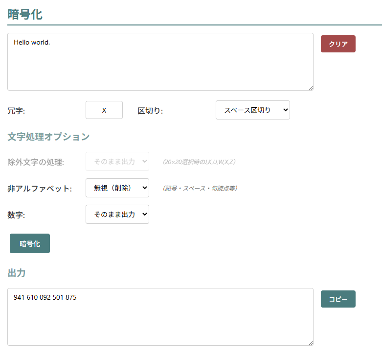
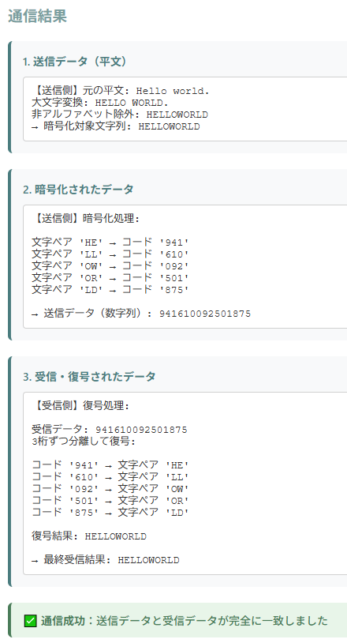
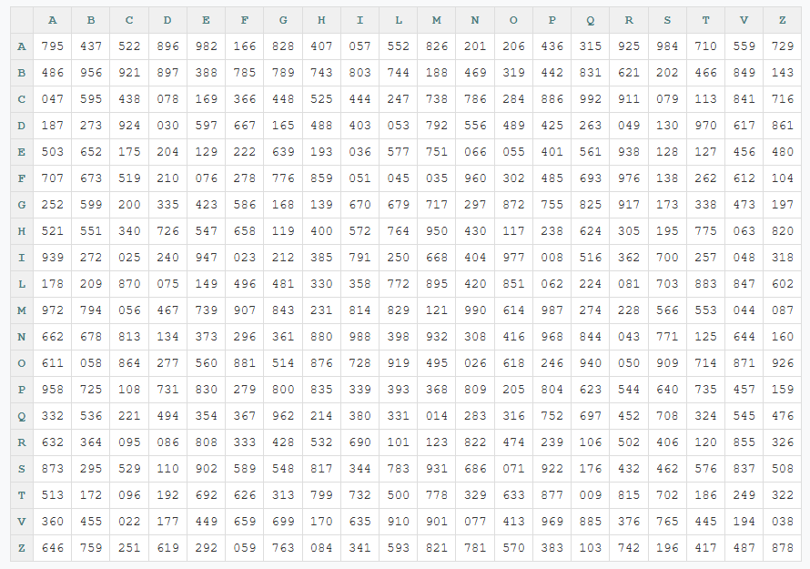
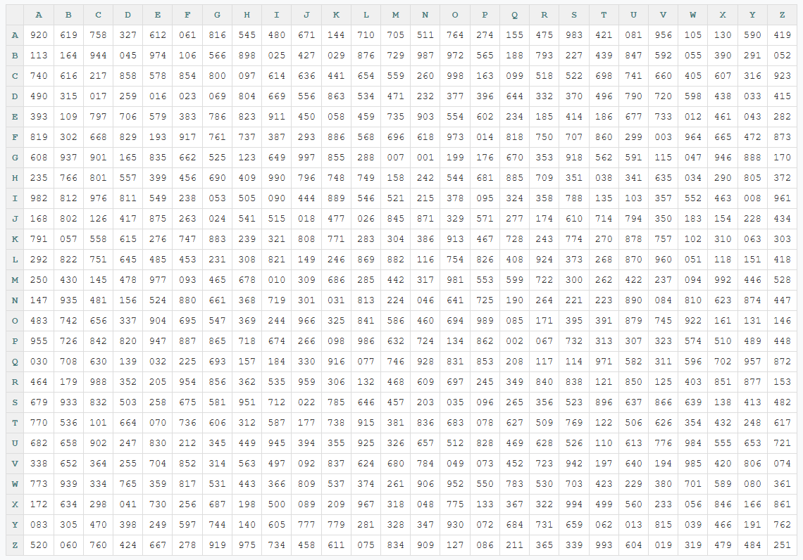

<!--
---
title: Porta CipherLab
category: classical-cryptography
difficulty: 2
description: Interactive web tool to learn Porta’s digraphic cipher (連字暗号). Encrypt and decrypt using 20×20 substitution tables, with 3-digit codes or alternative mappings.
tags: [porta-cipher, digraphic, classical-crypto, education, visualization, javascript]
demo: https://ipusiron.github.io/porta-cipherlab/
---
-->

# Porta CipherLab - ポルタ連字暗号ツール


[](https://ipusiron.github.io/porta-cipherlab/)

**Day080 - 生成AIで作るセキュリティツール100**


**Porta CipherLab** は、イタリアの学者 *Giovanni Battista della Porta*（1543?–1615）が考案した **連字暗号（digraphic cipher）** を体験できる教育用ツールです。  

- 「平文2文字 → 暗号記号1つ」という **多文字式暗号** の初期例  
- 「20×20マトリクス」と「26×26マトリクス」を利用  
- 本ツールでは実用性を考慮し、各セルに **3桁乱数** を割り当てて暗号化／復号を実装  
- 歴史的なオリジナル暗号表（記号版）は **座学タブに画像埋め込み** として参照可能  

---

## 🌐 デモページ

👉 **[https://ipusiron.github.io/porta-cipherlab/](https://ipusiron.github.io/porta-cipherlab/)**

ブラウザーで直接お試しいただけます。

---

## 📸 スクリーンショット

>
>*"Hello world."を暗号化する*
>
>
>*「暗号化⇒復号」の過程*

---

## ⚙️ 機能

### 🔑 置換表生成
- **マトリクスサイズ選択**: 20×20（古典）/ 26×26（拡張）の切り替え
- **シード機能**: 同一シード値で同じ置換表を再生成可能
- **予約コード**: 特別用途のコード（000,999等）を除外
- **エクスポート／インポート**: JSON形式での置換表の保存・読み込み
- **可視化**: ホバー効果付きのインタラクティブなマトリクス表示

### 🔐 暗号化
- **平文処理**: 2文字ペア単位での暗号化
- **文字処理オプション**:
  - 除外文字（20×20モード時のJ,K,U,W,X,Z）の処理選択
  - 非アルファベット文字の処理選択
  - 数字の処理選択
- **冗字機能**: 奇数文字時の自動パディング
- **出力形式**: スペース区切り／3桁連結の選択
- **UI改善**: クリアボタン、リアルタイム設定連動

### 🔓 復号
- **逆引き復号**: 3桁コードから2文字ペアへの変換
- **冗字削除**: 自動的なパディング文字除去
- **入力形式**: スペース区切り／3桁連結に対応
- **エラーハンドリング**: 不正コードの適切な処理

### 📡 通信シミュレーター
- **完全な通信フロー**: 送信側暗号化 → 受信側復号を一画面で体験
- **処理詳細表示**: 各ステップ（文字処理・暗号化・復号）の可視化
- **実際の通信再現**: 数字列のみでの送受信をシミュレート
- **結果判定**: 送信データと受信データの比較・成否判定
- **使い方説明**: 平文入力であることを明確化

### 📚 座学
- **歴史的背景**: Giovanni Battista della Portaと連字暗号の解説
- **原典資料**: オリジナル暗号表の画像表示
- **セキュリティ警告**: 教育目的での使用に関する注意事項

### 🎨 UI/UX改善
- **レスポンシブデザイン**: モバイル・タブレット・デスクトップ対応
- **モダンなデザイン**: CSS変数、グラデーション、アニメーション
- **操作性向上**: ツールチップ、トースト通知、直感的なボタン配置
- **アクセシビリティ**: 適切なコントラスト、キーボードナビゲーション対応  

---

## 🎭 暗号表の多様な表現

ポルタ連字暗号は「20×20マトリクス」という構造を基本としながら、セルに割り当てる内容を柔軟に変えることが可能です。  

1. **原典方式（記号表）**  
   - 各セルに固有の記号を配置（例：円や線の組み合わせ、回転・反転でバリエーションを生成）  
   - Giovanni Battista della Portaが示したオリジナル  

   

2. **本ツール方式（3桁乱数表）**  
   - 各セルにユニークな3桁乱数（000〜999）を割り当て  
   - 実用的に送受信しやすく、教育的にも扱いやすい  

3. **別表現（2文字ペア表）**  
   - 各セルに「2文字ペア」をランダムに配置（重複なし）  
   - 「平文2文字 → 暗号文2文字」に変換  
   - 676枚（AA〜ZZ）のカードを攪拌し、マトリクスに順次配置した状況と等価  

この多様性は、**暗号表の設計方法が暗号文の形式を決める** という事実を学ぶ上で重要です。

### 3桁乱数表の例

#### 20×20マトリクス（J,K,U,W,X,Z除外）

>
>*20×20マトリクスの例*

#### 26×26マトリクス（全アルファベット）

>
>*26×26マトリクスの例*

---

## 📜 歴史的背景

- **Giovanni Battista della Porta (1543?–1615)**  
  - イタリアの物理学者・哲学者  
  - 著作『自然魔法 (Magia naturalis)』などで知られる  
  - 1563年『De furtivis literarum notis』にて暗号法を記述  

- ポルタ連字暗号は、「**平文2文字 → 記号1つ**」という変換を実現する連字暗号として暗号史に登場。  
- 暗号表は20文字アルファベット（J,K,U,W,X,Zを除外）で構成し、20×20=400セルを使用。  
- セルに何を割り当てるか（記号／数字／文字ペア）は設計次第。  
- 実用上は **400種類の記号管理が重く**、現代では教育的な題材として扱われる。  

---

## 🎓 教育的な意義

- **多文字式暗号の直感**  
  - 単純な単表置換よりも複雑な「2文字単位の変換」の感覚を体験できる。  
- **暗号表設計の多様性**  
  - 記号、乱数、文字ペアなど、セルの設計が暗号の性質を変えることを学べる。  
- **通信の工夫**  
  - 数字列化や区切り記号の導入など、運用設計の重要性を体験できる。  

---

## 📚 活用シナリオ

1. **基本操作の習得**
   - 手順: 「置換表生成」→ マトリクスサイズ選択 → 「3桁乱数表を生成」→ 「暗号化」タブで平文入力 → 暗号化実行
   - 学習ポイント: 2文字ペア単位の暗号化、パディング文字の役割、マトリクスの可視化
   - 例:
     ```
     1. 置換表生成: 26×26マトリクス生成
     2. 暗号化: 平文「HELLO WORLD」→ 設定確認 → 暗号化実行
     3. 出力: スペース区切りで「123 456 789 012 345」形式
     ```

2. **シード機能による再現性学習**
   - 手順: シード値「DEMO2024」で置換表生成 → 暗号化 → 別環境で同じシードで再生成 → 同一結果確認
   - 学習ポイント: 暗号における鍵の重要性、再現可能性の意味
   - 例:
     ```
     シード「DEMO2024」→ 全員が同じ置換表を生成
     平文「SECRET MESSAGE」→ 全員が同じ暗号文を得る
     ```

3. **通信シミュレーターでの実践学習**
   - 手順: 「通信シミュレーター」タブ → 平文入力（例：「ATTACK AT DAWN」）→ 送信&受信 → 各ステップの詳細確認
   - 学習ポイント: 実際の暗号通信の流れ、文字処理の影響、数字列での送受信
   - 例:
     ```
     入力: 「Attack at dawn!」
     処理: 大文字変換 → 非アルファベット除外 → 「ATTACKATDAWN」
     結果: 各処理段階を可視化、送受信の成否判定
     ```

4. **マトリクスサイズ比較学習**
   - 手順: 同じ平文で20×20と26×26を切り替えて暗号化 → 結果の違いを観察
   - 学習ポイント: 除外文字の影響、マトリクスサイズによる暗号文の変化
   - 例:
     ```
     平文「JUPYTER」→ 20×20: 「PUTER」(J,U除外) → 26×26: 「JUPYTER」(全文字)
     結果の違いから暗号仕様の重要性を学習
     ```

5. **CTF/演習問題作成**
   - 手順: 区切りなし(3桁連結)で暗号文を作成 → ダミー文字を混在 → 問題文として出題。
   - ヒント設計: 20×20、ダミー=“X”、予約コードの存在などを段階的に開示。
   - 例:
     ```
     平文: MEET AT NOON → パディング後: MEETATNOONX
     出題: 731640502118903456（鍵依存）
     ```

5. UI/UX・可用性評価
   - 手順: モバイル幅/デスクトップ幅で鍵表示・入出力UIの操作性を確認 → エラーメッセージや状態表示をレビュー。
   - 観点: 学習者が迷わない文言、視認性、フォーカス移動。

6. 実験ノート（スループットと冗長度）
   - 手順: 同一の平文に対し20×20/26×26・区切りあり/なしを試行 → 文字数増加率を比較。
   - 考察: 3桁化による帯域・誤り耐性のトレードオフ。
   - 例と目安:
     ```
     平文長N（奇数はダミーで+1）→ ペア数 = ceil(N/2)
     区切り=none: 出力桁数 ≈ 3×ceil(N/2)
     区切り=space: 出力桁数 ≈ 4×ceil(N/2) - 1
     ```

7. 通信シミュレーターでの手順確認
   - 手順: 平文入力 → 暗号化 → 受信側復号の流れを一画面で再現。
   - 目的: 誤設定（区切り・ダミー）の影響を可視化し、ルール設計の重要性を体感。
   - 例:
     ```
     入力: ATTACK AT DAWN
     シミュレーター結果: 送信=暗号文 / 受信=ATTACKATDAWN（鍵と設定が一致した場合）
     ```

---

## ⚠️ 制限事項と仕様

### マトリクスサイズによる制限
- **20×20マトリクス**: 古典的なポルタ連字暗号の仕様（J,K,U,W,X,Zを除外）
- **26×26マトリクス**: 全アルファベット対応の拡張版

### 文字処理の仕様
- **基本動作**: アルファベット文字のみが暗号化対象
- **除外文字**: 20×20モード時はJ,K,U,W,X,Zが処理から除外
- **非アルファベット文字**: 数字・記号・スペース等の処理は設定で選択可能
  - 「そのまま出力」: 暗号文に混在（推奨しない）
  - 「無視（削除）」: 暗号化処理から除外（推奨）

### 通信での制約
- **実際の通信**: 数字列のみで送受信（スペースや記号は含まれない）
- **復号時の課題**: 元の文章の空白や句読点は復元されない

### 例
- 平文: `MEET AT 5`  
- 暗号化対象: `MEETAT`（数字「5」は除外）  
- 復号結果: `MEETAT`（「5」は失われる）  

### 数字を残すオプションを選んだ場合
- 暗号文の出力には「暗号化された3桁乱数」と「元の数字」が混在する。  
- この場合、復号時に **「これは暗号コードか、元の数字か」** の区別ができなくなる。  
- 例:  
  - 暗号表セルに「137」が割り当てられていた場合、  
  - 平文に含まれる数字「137」と暗号コード「137」が衝突し、解読不能になる。  
- したがって、数字をそのまま残すオプションは **デモ用の実験的機能** として提供されており、  
  実用上は推奨されない。

---

## 🚨 注意点

本ツールは教育目的で提供されています。
ポルタ連字暗号は古典暗号であり、現代的なセキュリティを提供するものではありません。

---

## 📁 ディレクトリー構成

```
porta-cipherlab/
├── assets/                    # 画像・リソースファイル
│   ├── 20x20_matrix.png       # 20×20マトリクスのサンプル画像
│   ├── 26x26_matrix.png       # 26×26マトリクスのサンプル画像
│   ├── porta_matrix.jpg       # ポルタ原典の置換表の画像
│   ├── screenshot.png         # メイン画面のスクリーンショット
│   └── screenshot2.png        # 暗号化・復号過程のスクリーンショット
├── .claude/                   # Claude Code設定ディレクトリ
│   └── settings.local.json    # ローカル設定ファイル
├── .gitignore                 # Git除外設定
├── .nojekyll                  # GitHub Pages設定（Jekyll無効化）
├── AGENTS.md                  # エージェント設定説明
├── CLAUDE.md                  # Claude用プロジェクト情報
├── index.html                 # メインのHTMLファイル
├── script.js                  # JavaScript実装（暗号化ロジック・UI制御）
├── style.css                  # CSSスタイルシート（レスポンシブデザイン）
├── LICENSE                    # MITライセンス
└── README.md                  # プロジェクト説明（本ファイル）
```

---

## 📄 ライセンス

MIT License – 詳細は [LICENSE](LICENSE) を参照してください。

---

## 🛠 このツールについて

本ツールは、「生成AIで作るセキュリティツール100」プロジェクトの一環として開発されました。
このプロジェクトでは、AIの支援を活用しながら、セキュリティに関連するさまざまなツールを100日間にわたり制作・公開していく取り組みを行っています。

プロジェクトの詳細や他のツールについては、以下のページをご覧ください。

🔗 [https://akademeia.info/?page_id=42163](https://akademeia.info/?page_id=42163)
