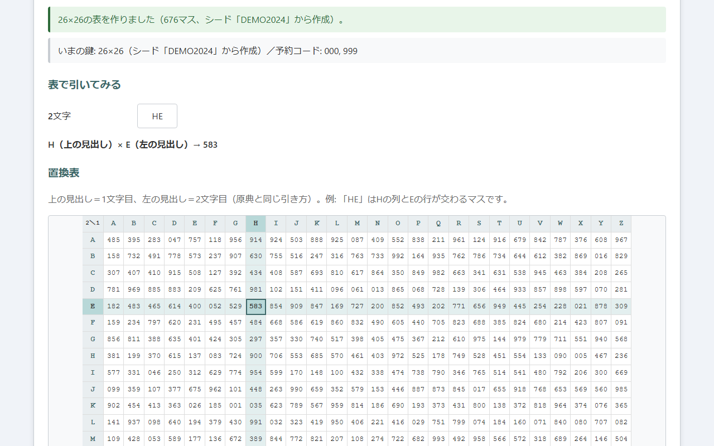
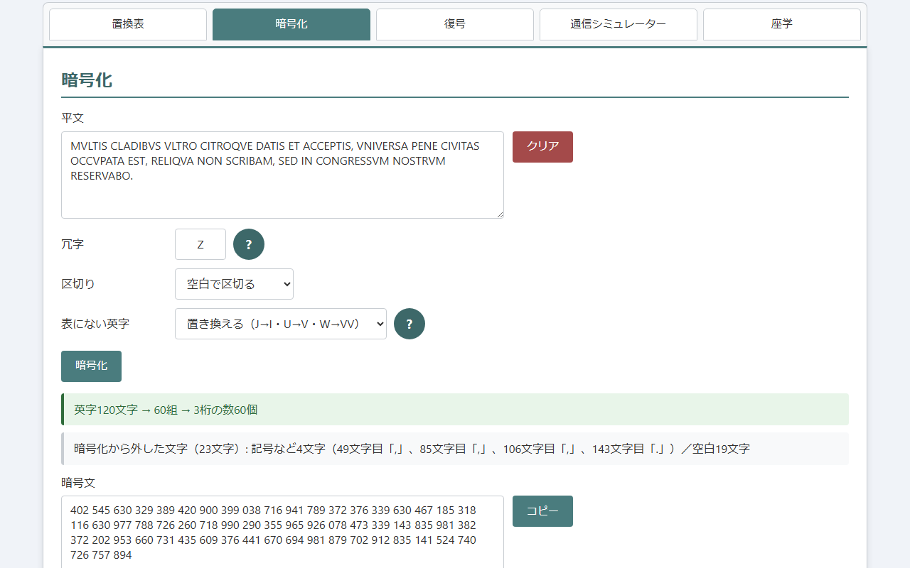
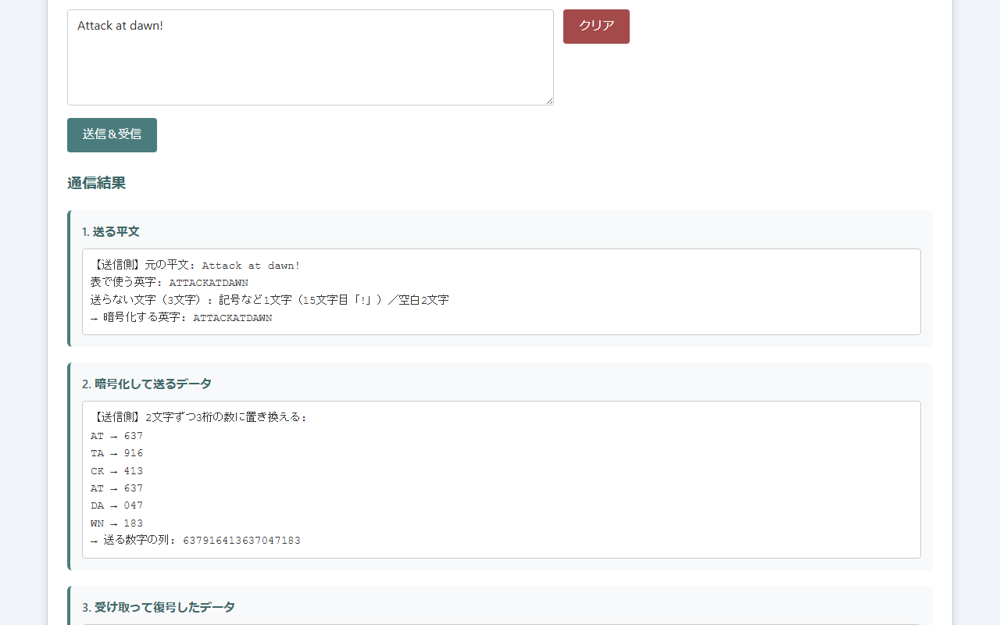
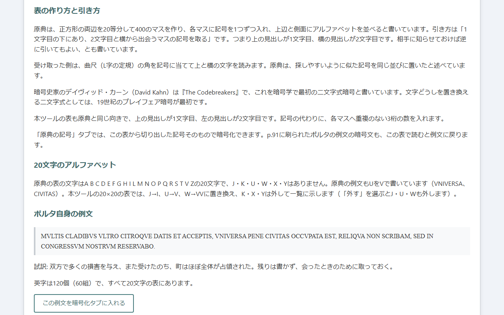
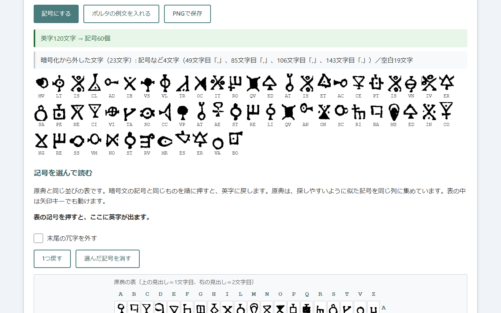
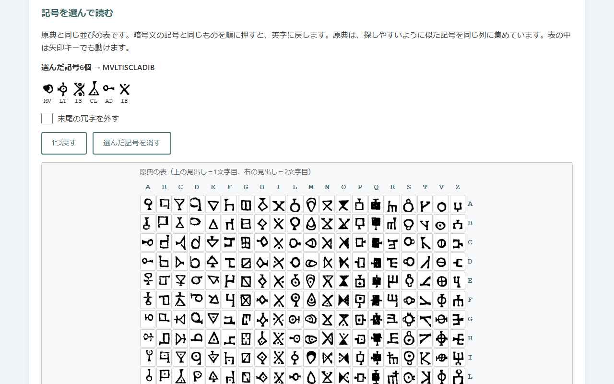

<!--
---
id: day080
slug: porta-cipherlab

title: "Porta CipherLab"

subtitle_ja: "ポルタの二文字式暗号ツール"
subtitle_en: "Porta's Digraphic Cipher Lab"

description_ja: "Giovanni Battista della Portaが1563年に示した二文字式暗号（digraphic cipher）を体験できる教育用ツール。原典どおりの20×20の表（または26×26の表）の各マスに重複のない3桁の数を割り当て、平文の2文字を3桁の数に換えて暗号化・復号する。"
description_en: "Educational tool for Porta's 1563 digraphic cipher. Each cell of the original 20×20 table (or a 26×26 table) holds a unique 3-digit number, and every pair of plaintext letters becomes one number."

category_ja:
  - 古典暗号
  - 換字式暗号
category_en:
  - Classical Cryptography
  - Substitution Cipher

difficulty: 2

tags:
  - porta-cipher
  - digraphic-cipher
  - classical-crypto
  - substitution-matrix
  - education
  - visualization
  - javascript

repo_url: "https://github.com/ipusiron/porta-cipherlab"
demo_url: "https://ipusiron.github.io/porta-cipherlab/"

hub: true
---
-->

[English](README.en.md) · 日本語

# Porta CipherLab - ポルタの二文字式暗号ツール


[](https://ipusiron.github.io/porta-cipherlab/)

**Day080 - 生成AIで作るセキュリティツール100**

**Porta CipherLab**は、イタリアの学者ジョヴァンニ・バッティスタ・デッラ・ポルタ（Giovanni Battista della Porta、1535年ごろ〜1615年）が1563年の暗号書で示した二文字式暗号（digraphic cipher）を体験できる教育用ツールです。
平文を2文字ずつ区切り、表の1マスに置き換えます。原典はマスに記号を入れましたが、本ツールは重複のない3桁の数を入れます。
1563年初版の表から切り出した原典の記号でも暗号化・復号でき、画面は日本語と英語を切り替えられます。

---

## 🌐 デモページ

👉 **[https://ipusiron.github.io/porta-cipherlab/](https://ipusiron.github.io/porta-cipherlab/)**

ブラウザーで直接お試しいただけます。

---

## 📸 スクリーンショット

>
>*26×26の表（シード「DEMO2024」）で「HE」を引くと、Hの列とEの行が交わるマス（583）を示す*
>
>
>*原典の20×20の表で、ポルタ自身の例文（英字120個）を60個の数に換える*
>
>
>*通信シミュレーター。「Attack at dawn!」のATの組は2回とも637になる*
>
>
>*座学タブ。原典にもとづく表の作り方・引き方、20文字のアルファベット、ポルタ自身の例文*
>
>
>*原典の記号タブ。1563年初版の表から切り出した記号で、ポルタの例文を60個の記号にする*
>
>
>*原典と同じ並びの表（上＝1文字目、右＝2文字目）から記号を押して英字に戻す*

---

## ✨ 機能

### 🔑 置換表（鍵）

- 表の大きさ: 20×20（原典の20文字）と26×26（A〜Zのすべて）
- 作り方: シードを入れると同じ表を作り直せる。空欄なら暗号用の乱数（`crypto.getRandomValues`）で作る
- 予約コード: マスに使わない3桁の数（既定は000と999）
- 表で引いてみる: 2文字を入れると、その組のマスを表の中で示す
- 鍵の書き出しと読み込み: JSONファイル（読み込むときに形と値を検証する）

### 🔐 暗号化

- 平文の英字（全角英字・小文字を含む）を2文字ずつ区切り、3桁の数に換える
- 英字が奇数個なら、最後に冗字を1つ足す（既定は26×26がX、20×20がZ。どちらも表にある文字）
- 20×20の表にない英字は、J→I・U→V・W→VVに置き換えるか、外すかを選べる（K・X・Yは外す）
- 空白・記号・数字は暗号化から外し、種類ごとに位置つきで一覧に示す
- 出力は空白で区切るか、3桁ずつ連結するかを選べる
- 組と数の対応を一覧で示す

### 🔓 復号

- 3桁の数を表から逆に引いて2文字に戻す
- 区切りの形の誤り（3桁でない数・桁の余り・数字以外）を、位置つきで知らせる
- 表にない数は「??」で示し、予約コードは区別して知らせる
- 末尾の冗字を外すかどうかを選べる

### 🖋️ 原典の記号

- 1563年初版p.90の表から切り出した記号400個で、平文を記号の列にする（組の文字の表示とPNG保存）
- 原典と同じ並びの表から記号を押して英字に戻す（矢印キーでも動く）
- p.91に刷られたポルタの例文の暗号文を、表で読む練習と答え

### 📡 通信シミュレーター

- 送る側の暗号化 → 数字の列の送信 → 受ける側の復号を、いまの表で通しで行う
- 各段階の組と数、送らなかった文字・置き換えた文字を示し、届いた英字が一致したかを判定する

### 🌏 日本語と英語

- 画面右上のボタンで日本語と英語を切り替える（URLの`?lang=ja`・`?lang=en`でも指定できる）
- 選んだ言語はブラウザーに保存する（保存できない環境でも切り替えは効く）。指定がなければブラウザーの言語で決める
- 切り替えると、表示中の結果（状態の文・一覧・通信の結果・記号の説明）も描き直す

### 📚 座学

- 原典（1563年初版の第2巻第13章）にもとづく表の作り方・引き方・20文字のアルファベット
- ポルタ自身の例文と、暗号化タブへ入れるボタン
- 「同じ記号が文中に2度出ることはまれ」という原典の主張と、英文での実測
- 関連ツールと出典

---

## 📖 使い方

1. 「置換表」タブで表の大きさを選び、「表を作る」を押す（シードを入れると同じ表を作り直せる）
2. 「暗号化」タブで平文を入れ、「暗号化」を押す
3. 相手には、同じ表（シードか、書き出した鍵のファイル）と暗号文を渡す
4. 相手は「復号」タブで暗号文を入れ、「復号」を押す

通しの流れは「通信シミュレーター」タブで一度に確かめられます。
原典の記号で試すときは「原典の記号」タブを使います（表は原典の20×20に固定）。

---

## 📜 ポルタの二文字式暗号

### 原典

>
>*1563年初版p.90の表。上の見出しが1文字目、右の見出しが2文字目（リヨン市立図書館所蔵本のスキャン、Public Domain Mark 1.0）*

ポルタは1563年にナポリで刊行した『De Furtivis Literarum Notis, vulgo de Ziferis libri IIII』の第2巻第13章で、この表を示しました。
相互式の多表換字（いわゆる「ポルタ暗号」）とは別の方式です。
暗号史家のデイヴィッド・カーン（David Kahn）は『The Codebreakers』（1967年）で、これを暗号学で最初の二文字式暗号としています（p.139）。
文字どうしを置き換える二文字式としては、19世紀のプレイフェア暗号が最初です（同書p.200）。

- 表の作り方: 正方形の両辺を20等分して400のマスを作り、各マスに記号を1つずつ入れ、上辺と側面にアルファベットを並べる
- 引き方: 1文字目の下にあり、2文字目と横から出会うマスの記号を取る。つまり上の見出しが1文字目、横の見出しが2文字目である。相手に知らせておけば逆に引いてもよい、とも書いている
- 受け取る側: 曲尺（L字の定規）の角を記号に当てて上と横の文字を読む。探しやすいように、似た記号を同じ並びに置いている
- 20文字のアルファベット: A B C D E F G H I L M N O P Q R S T V Z（J・K・U・W・X・Yはない）。例文もUをVで書く

本ツールの表も原典と同じ向きで、上の見出しが1文字目、左の見出しが2文字目です。

### ポルタ自身の例文

```text
MVLTIS CLADIBVS VLTRO CITROQVE DATIS ET ACCEPTIS, VNIVERSA PENE CIVITAS OCCVPATA EST,
RELIQVA NON SCRIBAM, SED IN CONGRESSVM NOSTRVM RESERVABO.
```

試訳は「双方で多くの損害を与え、また受けたのち、町はほぼ全体が占領された。残りは書かず、会ったときのために取っておく」です。
英字は120個（60組）で、すべて20文字の表にあります。

p.91には、この例文を表の記号にした暗号文が刷られています。
「1文字目＝上の見出し、2文字目＝横の見出し」で表から引いた記号の列と1つずつ見比べると、60個すべてが同じ順に並びます（行ごとの数は15・12・15・13・5）。
逆に引いた表（1文字目を横の見出し）では、最初の記号から食い違います。
本ツールの「原典の記号」タブで、この照合を確かめられます。

>
>*1563年初版p.91の例文の暗号文（記号60個、5行。リヨン市立図書館所蔵本のスキャン、Public Domain Mark 1.0）*

### 同じ記号は本当に「まれ」か

原典は、2文字を1つの記号にするので同じ記号が文中に2度出ることはまれだ、と述べています。
しかし例文の120字の中でも、ISの組は3回、QV・ED・AT・ER・ST・REは2回ずつ出ます。
英語の小説（ディケンズ『二都物語』、Project Gutenberg）から無作為に200か所を切り出して数えると、次のとおりです。

| 英字の数 | 組の数 | 2回以上出る組の割合 | 最多の組の回数（平均） |
|---:|---:|---:|---:|
| 100 | 50 | 29.4% | 3.1 |
| 200 | 100 | 45.4% | 4.8 |
| 1,000 | 500 | 82.4% | 18.2 |

手紙1通ほどの長さでも、同じ数はふつうに繰り返します。
英語ではTH・HE・ERなどの組が多く、この偏りが二文字式の暗号を解く手がかりになります。

ただし、平文の同じ単語でも、奇数番目の文字から始まるか偶数番目の文字から始まるかで別の組に分かれます。
米陸軍の教範FM 34-40-2（1990年）は、このため平文の繰り返しのおよそ半分は暗号文の上で繰り返しにならない、と説明しています。

---

## 🔬 技術的な説明

### 暗号化と復号の例

次の表の暗号文は、`test/readme.test.js`が計算部で計算し直して一致を確かめています（予約コードは000と999、冗字は表の既定）。

| 表 | シード | 平文 | 設定 | 暗号文 |
|---|---|---|---|---|
| 26×26 | DEMO2024 | Hello world. | 空白で区切る | 583 950 564 161 096 |
| 26×26 | DEMO2024 | MEET AT NOON | 連結 | 727674637638402 |
| 20×20 | PORTA1563 | Jupiter was here | 置き換える | 788 505 701 141 757 717 726 501 |
| 20×20 | PORTA1563 | Jupiter was here | 外す | 505 701 538 717 726 501 |

20×20の表で置き換えると「Jupiter was here」はIVPITERVVASHEREになり、15文字なので冗字Zを足して8組です。
外すとPITERASHEREに冗字Zを足して6組です。

### 表と鍵のファイル

- 各マスに、000〜999から予約コードを除いた数の中から重複のない数を入れる
- 並べ方はFisher–Yatesのシャッフルで、整数の選び方は棄却法（偏りなし）
- シードありは擬似乱数（cyrb128でシードから128ビットの状態を作り、sfc32で列を出す）。同じシードからは同じ表ができる。シードはUnicodeのNFCにそろえてから使う
- シードなしは暗号用の乱数（`crypto.getRandomValues`）
- 鍵のファイルはJSONで、`matrix[1文字目][2文字目]`に3桁の数を持つ。書き出す形は`format`・`version`（2）・`size`・`alphabet`・`order`・`reserved`・`matrix`で、`format`と`version`のない形（`alphabet`・`reserved`・`matrix`だけ）も同じ意味で読み込む

### 原典の記号の切り出し

- 元の画像は1563年初版p.90のスキャン（リヨン市立図書館所蔵本、Internet Archive、Public Domain Mark 1.0、1771×2500px）
- 表を貫く長い直線（格子の線）を形態学的な処理で見つけて消し、手彫りで傾いた線は行・列の帯ごとに位置を測り直して、1マスずつ切り出した
- 大津の方法で白黒にし、縁に残った線の切れ端と小さな点のごみを消し、1マス52×64pxにそろえて8段階の濃淡のPNG（20×20、1040×1280px）にした
- 400個すべてを原本と並べて目で確かめ、線の切れ端が記号につながった6マスは辺を削り、線の傾きで範囲がずれた2マスは原本で測った範囲で切り出した。切り出しのスクリプトと原本はリポジトリーの外で管理している
- 画像の内容は`test/symbols.test.js`がSHA-256で固定している

### 表の強さ

乱数で作る20×20の表は、998個の数から400個を並べるので約2の3850乗通りあります。
ただしシードから作る表の推測しにくさは、シードの推測しにくさで決まります。
短い単語のシードは、辞書の単語を順に試せば当てられます。

### 入力の扱い

| 項目 | 扱い |
|---|---|
| 平文 | 半角・全角の英字だけを暗号化する。空白・記号・数字・アクセントつきの文字は外して一覧に出す |
| 20×20の表にない英字 | 置き換える（J→I・U→V・W→VV）か外す。K・X・Yはどちらでも外す |
| 冗字 | 表にある1文字。表にない文字はエラー |
| 暗号文（空白で区切る） | 空白・改行で区切った3桁の数。全角数字も読む |
| 暗号文（連結） | 空白を無視して3桁ずつ区切る。桁が余ればエラー |
| 上限 | 平文・暗号文は10,000文字、シードは200文字、予約コードは300個、鍵のファイルは200,000バイト |

---

## 🎯 ユースケース

### 学ぶ・教える

- 世界史の授業: 16世紀の暗号書の表（座学タブの画像）と、数字版で同じ仕組みを並べて見せ、ルネサンス期の外交や戦争で暗号が必要だった背景を話す材料にする
- ラテン語・西洋古典の授業: ポルタ自身の例文を読み、UをVで書く当時の綴りと、20文字のアルファベットの関係を確かめる
- 情報の授業・プログラミング学習: 2次元の表を引く・逆に引く・乱数で並べ替える（Fisher–Yates）処理を、画面で動かしながら学ぶ
- 数学（組合せ）の授業: 400マスの並べ方の数と、シードから作れる表の数を比べ、「鍵の強さは何で決まるか」を考える
- 暗号解読の入門: 長い英文を暗号化し、同じ数が何度も出ることから二文字の頻度分析の考え方をつかむ
- 書誌学・古文書の入門: 16世紀の印刷本に刷られた暗号文を、同じ本の表で実際に読み解き、版面の図版を一次資料として扱う経験をする
- 海外の読者との共有: 英語の画面と英語版のREADMEがあるので、英語圏の授業や読書会でも、16世紀イタリアの暗号書を一次資料として紹介できる

### 作る・遊ぶ

- 謎解き・脱出ゲームの制作: 表を印刷して小道具にし、3桁の数の暗号文を解かせる。シードを決めておけば同じ表を何度でも作り直せる
- 記号の暗号の小道具: 原典の記号の列をPNGで保存し、カードや謎解きの台紙に印刷する（表のページも一緒に渡せば、手で読める）
- 宝探し・オリエンテーリング: 数字だけの暗号文は書き写しやすく、看板やカードに載せやすい
- 小説・ゲームの小道具: 作中の古い暗号書に出てくる暗号文を、筋の通った手順で作る
- 家族や友人とのやりとり遊び: 鍵のファイルを共有して、短いメモを暗号にして渡し合う（安全ではない前提で）

### セキュリティの学習・演習

- CTF・演習の作問: 表を渡す・渡さない、既知の平文を一部だけ渡すなど、難易度を変えた問題を作る
- 通信の手順の設計: 冗字・区切り・予約コードの取り決めが受け取る側にどう影響するかを、通信シミュレーターで確かめる
- 乱数の学習: シードありとなしの違い（作り直せることと推測しにくいことの引き換え）を体験する

### ほかのツールと組み合わせる

- [Playfair CipherLab](https://ipusiron.github.io/playfair-cipherlab/)（Day027）と比べ、規則で作る5×5の表と、自由に作る20×20の表の違いを見る
- [Polybius CipherLab](https://ipusiron.github.io/polybius-cipherlab/)（Day067）と比べ、1文字を2つの数字にする表と、2文字を1つの数にする表の違いを見る

本ツールは教育用です。実際の秘密のやりとりには使わないでください。

---

## 🔒 セキュリティ

- CSP（`default-src 'self'`、`script-src 'self'`、`style-src 'self'`、`connect-src 'none'`など）。インラインのスクリプト・イベントハンドラー・style属性は使わない
- 外部へは何も送信しない。外部のスクリプト・スタイル・画像も読まない
- `<meta name="referrer" content="no-referrer">`
- 画面への表示は`textContent`だけで行い、`innerHTML`を使わない
- 鍵のファイルは、大きさ（20×20か26×26）・文字の並び・3桁の数・重複・予約コードとの衝突を検証してから使う
- 入力・鍵はブラウザーに保存しない（ページを閉じると消える）。保存するのは表示の言語の選択だけ

ポルタの二文字式暗号そのものは安全ではありません。二文字の頻度分析で解けるうえ、平文の一部がわかれば、その組のマスの数がそのまま判明します。

---

## ⚠️ 注意と限界

- 復号の結果は大文字の英字だけで、空白・句読点・数字は戻らない
- 英字が偶数個で、最後の文字が冗字と同じとき（例: 冗字Xで「AX」）、復号で「末尾の冗字を外す」とその文字も消える。暗号化のときに警告する
- 20×20の表で置き換えると、復号の結果ではIとJ、VとUの区別がなくなり、WはVVになる
- 動作はWindowsのChromium・Microsoft Edge・Firefoxで確かめた。Safari・スマートフォンの実機・スクリーンリーダーでは確かめていない

---

## 🧪 テスト

```bash
npm test
```

- Node.js 22以上の`node --test`で動き、依存パッケージはない
- GitHub Actionsで、pushとpull requestのたびに自動で実行する
- 計算部の既知解答（乱数・表・暗号文）は、独立に書いたPythonの参照実装で計算した値と照合する
- READMEの暗号文の例・ディレクトリー構造・画像の参照もテストで検証する

---

## 🔗 参考

- Giovanni Battista della Porta, *De Furtivis Literarum Notis, vulgo de Ziferis libri IIII*, Naples, 1563, Liber II, cap. XIII（[Internet Archive](https://archive.org/details/bub_gb_sc-Zaq8_jFIC)、リヨン市立図書館所蔵本）。`assets/porta1563_table.jpg`はこのスキャンのp.90から表の部分を切り出したもの（Public Domain Mark 1.0）
- David Kahn, *The Codebreakers*, 1967, p.139, p.200
- U.S. Army, *FM 34-40-2 Basic Cryptanalysis*, 1990, 6-2
- Charles Dickens, *A Tale of Two Cities*（[Project Gutenberg #98](https://www.gutenberg.org/ebooks/98)）。組の繰り返しの実測に使った

---

## 📁 ディレクトリー構造

```text
porta-cipherlab/
├── .github/                   # GitHubの設定
│   └── workflows/             # GitHub Actionsのワークフロー
│       └── test.yml           # pushとpull requestでnpm testを実行する
├── assets/                    # 画像
│   ├── en/                    # 英語の画面の画像（README.en.md用）
│   │   ├── screenshot.png     # 置換表タブ（英語）
│   │   ├── screenshot2.png    # 暗号化タブ（英語）
│   │   ├── screenshot3.png    # 通信シミュレーター（英語）
│   │   ├── screenshot4.png    # 座学タブ（英語）
│   │   ├── screenshot5.png    # 原典の記号タブ・記号にする（英語）
│   │   └── screenshot6.png    # 原典の記号タブ・表から選んで読む（英語）
│   ├── porta1563_example.jpg  # ポルタの例文の暗号文（1563年初版p.91、Public Domain Mark 1.0）
│   ├── porta1563_symbols.png  # 原典の表から切り出した記号400個（20×20、1マス52×64px）
│   ├── porta1563_table.jpg    # 原典の表（1563年初版p.90、Public Domain Mark 1.0）
│   ├── screenshot.png         # 置換表タブ（26×26の表でHEを引いたところ）
│   ├── screenshot2.png        # 暗号化タブ（20×20の表でポルタの例文を暗号化）
│   ├── screenshot3.png        # 通信シミュレーター（同じ数が2回出る）
│   ├── screenshot4.png        # 座学タブ（表の作り方・引き方とポルタの例文）
│   ├── screenshot5.png        # 原典の記号タブ（ポルタの例文を記号にする）
│   └── screenshot6.png        # 原典の記号タブ（表から記号を選んで読む）
├── js/                        # 画面から読む通常のスクリプト
│   ├── i18n.js                # 言語の決定と固定の文言の差し替え
│   ├── messages.js            # 画面に出す文言の辞書（日本語・英語）
│   └── porta-core.js          # 計算部（正規化・暗号化・復号・鍵の生成と検証）
├── test/                      # 自動テスト（node --test）
│   ├── contrast.test.js       # 配色のコントラスト比
│   ├── core.test.js           # 計算部（既知解答・往復・鍵の検証）
│   ├── format.test.js         # 行の長さと表記
│   ├── html.test.js           # index.htmlの静的検証（CSP・ARIA・id）
│   ├── i18n.test.js           # 日英の辞書（キーの一致・英語に日本語が混じらない）
│   ├── load.js                # テストから画面と同じスクリプトを読み込む
│   ├── messages.test.js       # 辞書のキー
│   ├── readme.test.js         # READMEの例・画像・ディレクトリー構造
│   └── symbols.test.js        # 原典の記号（組とマスの位置・例文・画像の固定）
├── .gitignore                 # Gitの除外設定
├── .nojekyll                  # GitHub PagesでJekyllを使わない
├── AGENTS.md                  # コーディングエージェント向けの作業ルール
├── CLAUDE.md                  # Claude Code向けのプロジェクト情報
├── index.html                 # 画面（6つのタブ）
├── LICENSE                    # MITライセンス
├── package.json               # npm testの定義（依存なし）
├── README.en.md               # 英語版のREADME
├── README.md                  # 本ファイル
├── script.js                  # 画面の処理（タブ・表・入出力）
├── SECURITY_REVIEW.md         # セキュリティレビューの結果
└── style.css                  # スタイル
```

---

## 💻 動作環境

- 最近のブラウザー（Chromium系・Firefox）。ビルドは不要
- `index.html`をファイルとして開いても、HTTPで配信しても動く
- 英語の画面は`index.html?lang=en`か、画面右上のボタンで切り替える
- テストにはNode.js 22以上

---

## 📄 ライセンス

MIT License – 詳細は[LICENSE](LICENSE)を参照してください。

---

## 🛠️ このツールについて

本ツールは、「生成AIで作るセキュリティツール100」プロジェクトの一環として開発されました。
このプロジェクトでは、AIの支援を活用しながら、セキュリティに関連するさまざまなツールを100日間にわたり制作・公開していく取り組みを行っています。

プロジェクトの詳細や他のツールについては、以下のページをご覧ください。

🔗 [https://akademeia.info/?page_id=42163](https://akademeia.info/?page_id=42163)
